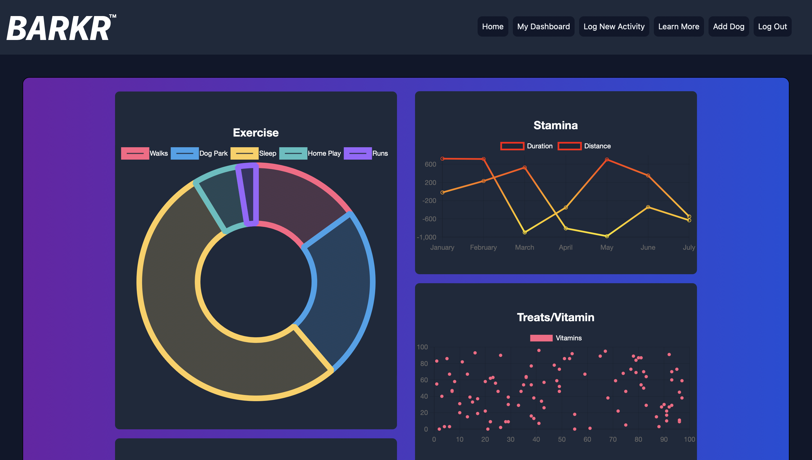
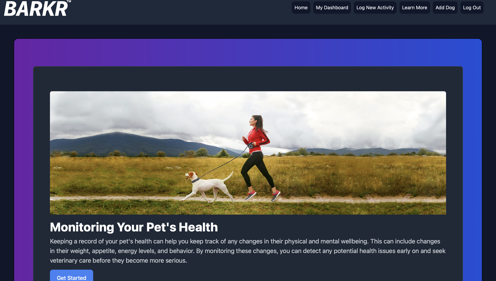
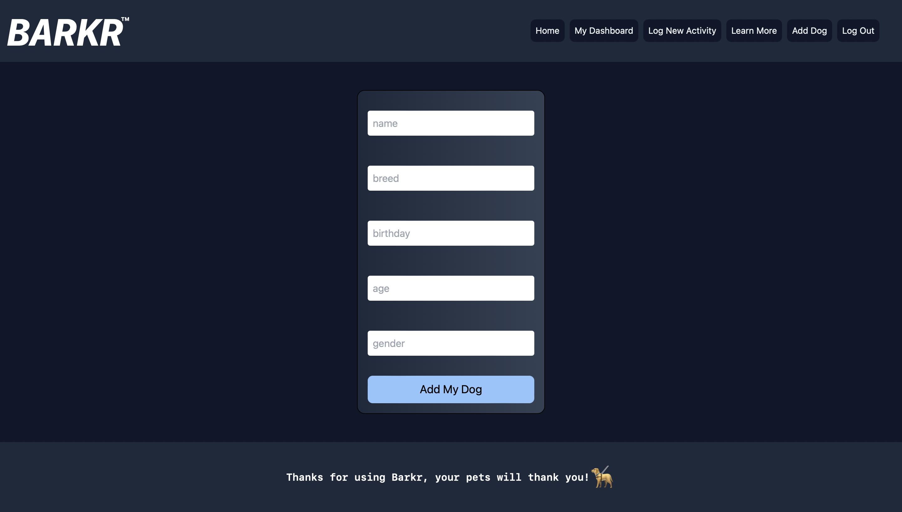

# BARKR

## Description

Barkr is a modern website are driven by dog health and well-being data analytics displayed in a dashboard. Barkr gives Dog parents insights and a birds-eye view of their dogs health. The main concept behind Barkr is a data dashboard that renders charts and graphs generated using data input from the user (dog owner), that gives insights into their dogs health and well-being. Eventually a doggy smart watch will replace the users data input.

## User Story

As a dog owner with multiple dogs, I want to be able to monitor my dogs health, i.e, their exercise, weight,  nutrition intake, daily treats. So that I can make better informed decisions, and better communicate with my vet when my dogs health is compromised.

## Technologies

* Tailwind CSS
* Chart.js
* react-chartjs-2
* Faker.js
* JWT
* React
* Express
* Apollo
* GraphQL
* Node.js
* Mongoose
* MongoDB

## Link to Application

https://secret-fjord-43776.herokuapp.com/home

## License

http://unlicense.org/

This is free and unencumbered software released into the public domain.

Anyone is free to copy, modify, publish, use, compile, sell, or distribute this software, either in source code form or as a compiled binary, for any purpose, commercial or non-commercial, and by any means.

In jurisdictions that recognize copyright laws, the author or authors of this software dedicate any and all copyright interest in the software to the public domain. We make this dedication for the benefit of the public at large and to the detriment of our heirs and successors. We intend this dedication to be an overt act of relinquishment in perpetuity of all present and future rights to this software under copyright law.

THE SOFTWARE IS PROVIDED "AS IS", WITHOUT WARRANTY OF ANY KIND, EXPRESS OR IMPLIED, INCLUDING BUT NOT LIMITED TO THE WARRANTIES OF MERCHANTABILITY, FITNESS FOR A PARTICULAR PURPOSE AND NONINFRINGEMENT. IN NO EVENT SHALL THE AUTHORS BE LIABLE FOR ANY CLAIM, DAMAGES OR OTHER LIABILITY, WHETHER IN AN ACTION OF CONTRACT, TORT OR OTHERWISE, ARISING FROM, OUT OF OR IN CONNECTION WITH THE SOFTWARE OR THE USE OR OTHER DEALINGS IN THE SOFTWARE.

For more information, please refer to http://unlicense.org/

## Contributions

There are no collaborators at the moment. However, if you would like to contribute, then refer to the Questions section.

## Questions

Reach me with additional questions here:

Github: RosalvaMartinez @ https://github.com/RosalvaMartinez

Email: rosalvahmartinez@gmail.com

